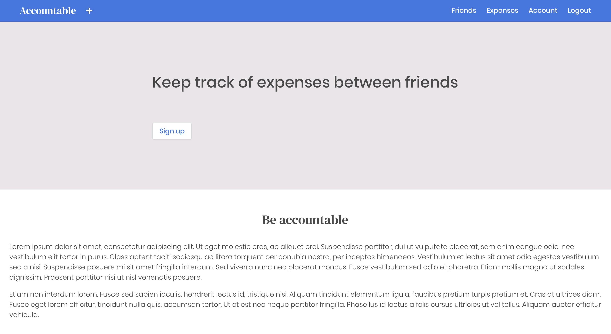
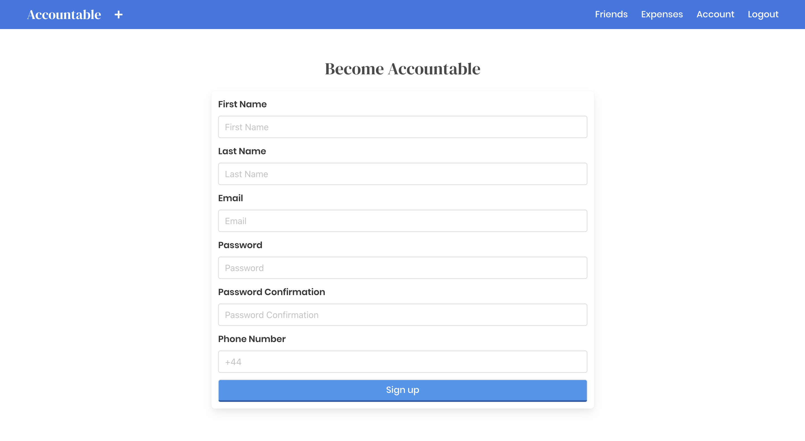
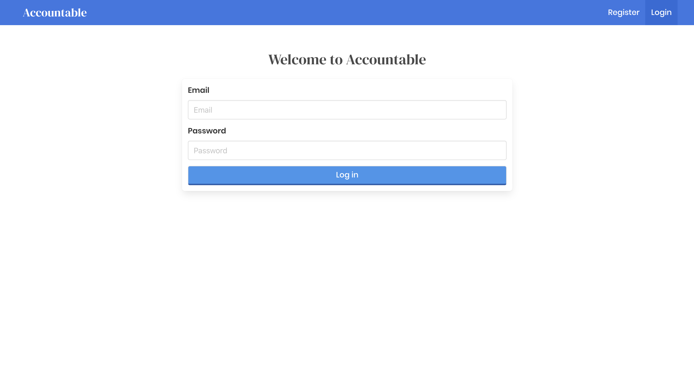
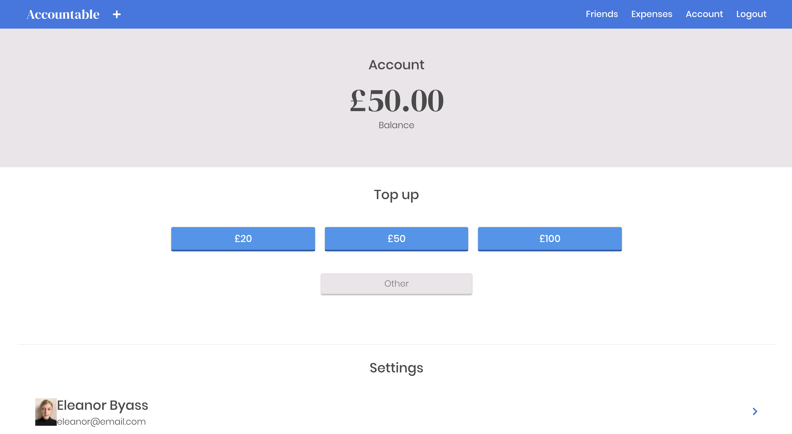
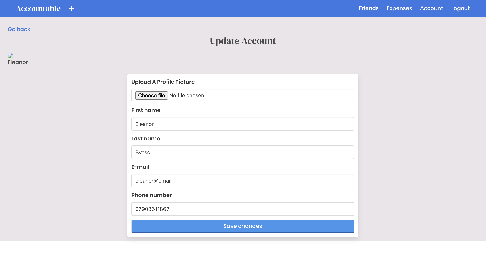
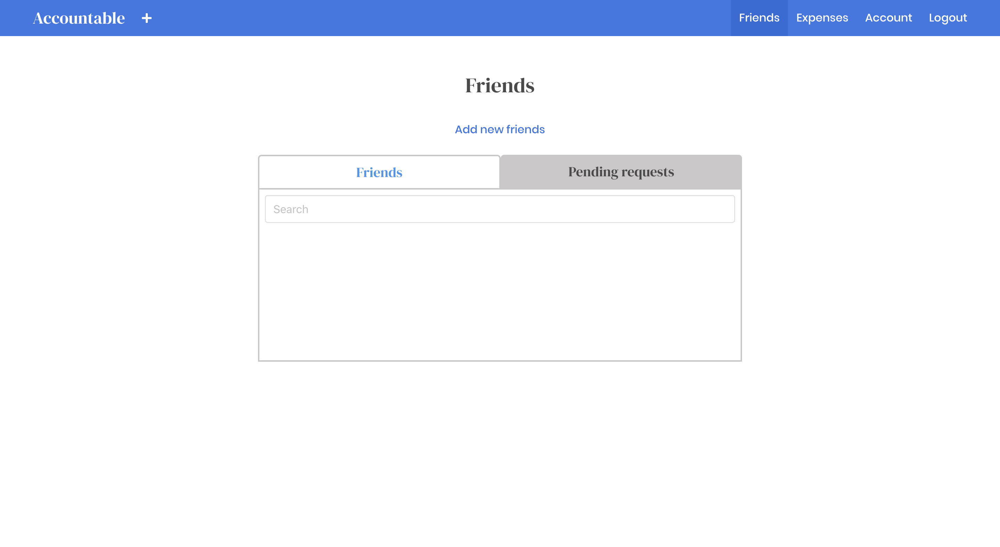
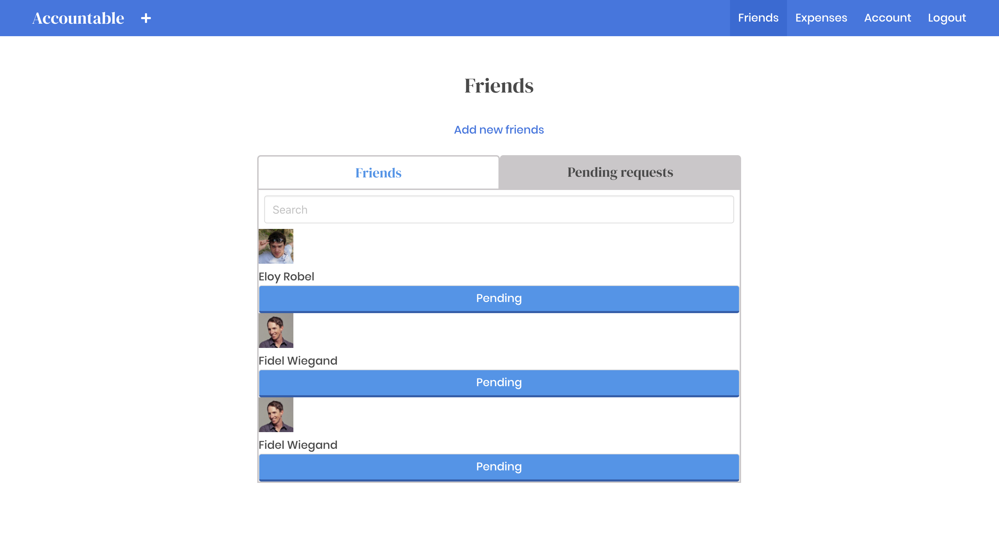
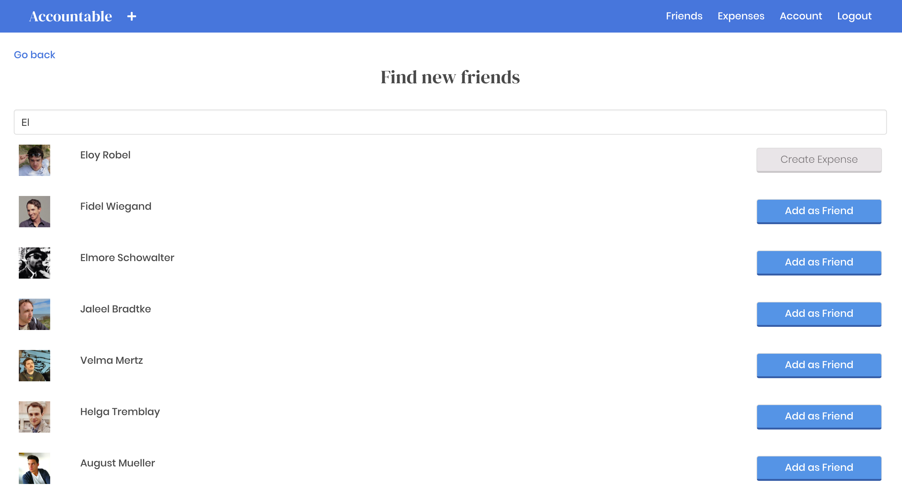
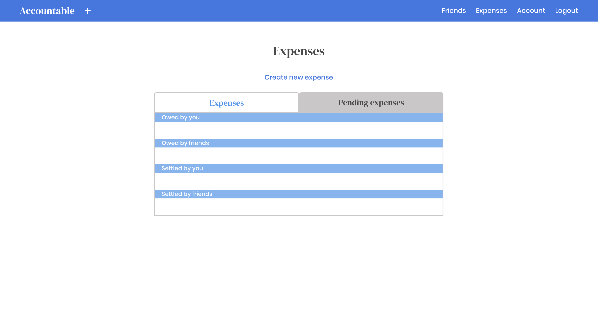
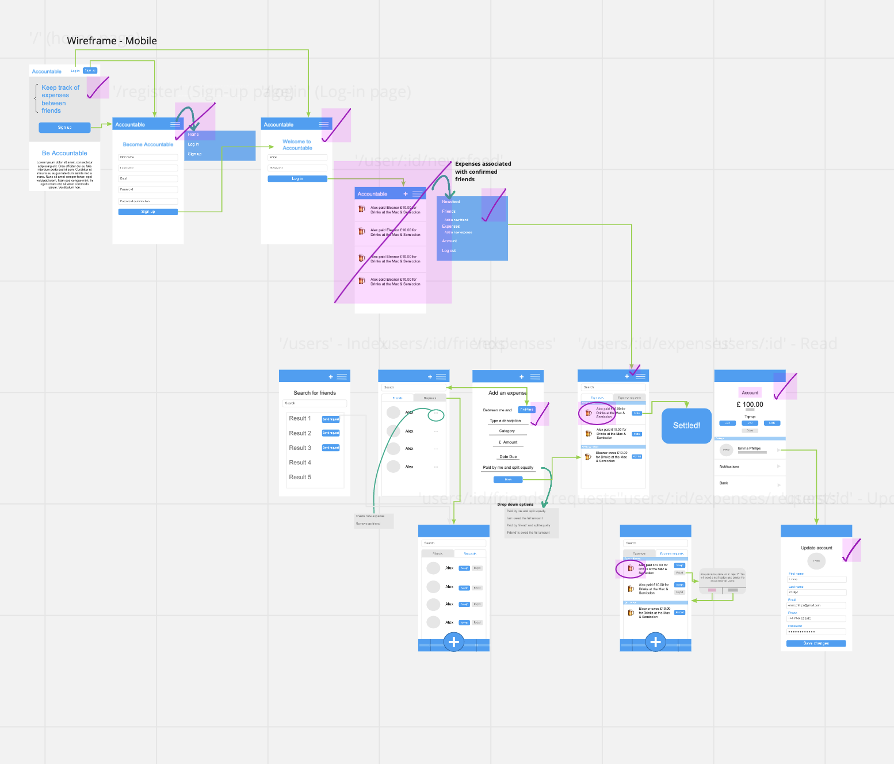

# Project 3: Full-Stack MERN App

# Brief

In groups of 3 we had to:

**Build a full-stack MERN application** by creating your own backend and your own front-end

**Use an Express API** to serve your data from a Mongo database

**Consume your API with a separate front-end** built with React

**Be a complete product** ensuring there are multiple relationships and CRUD functionality for at least a couple of models

**Implement thoughtful user stories/wireframes** to make clear the core features essential for MVP

**Deploy online** so it’s publicly accessible

# Timeframe

8 days 

# Technologies Used

* ReactJS
* NodeJS
* MongoDB & Mongoose
* JavaScript (ES6) / HTML5/ SCSS
* BCrypt 
* Sass
* Express
* Axios 
* Npm
* Bulma
* Insomnia

# Contributors

[Emma Phillips](https://github.com/emmajphillips)

[Alex Wheldon](https://github.com/awheldon)


# Deployment

This app has been deployed on Heroku and can be found [here](https://accountable-ebyass.herokuapp.com/)

# Getting Started

Use the clone button to download the source code. In the terminal enter the following commands 

`!-- To install all the packages listed in the package.json: -->`

`$ npm i`

`!-- Run the app in your localhost: -->`

`$ mongod --dbpath ~/data/db`

`!-- cd frontend && root of project -->`

`$ npm run start` 

`<!-- Check the console for any issues and if there are check the package.json for any dependencies missing -->`# 

# Accountable

In our team of 3 we created Accountable, a money sharing app built for users to track bills and split expenses with friends. My part of the project included building the models in Node.js,  building the friend request and friend search functionality, implementing authentication and creating the initial seeds file

# Screenshot Walk Through 

Landing page for logged out users prompting register/login.



Register page where users can enter their details.



Login page allows users to sign in.



The user’s home screen takes them directly to their account details, displaying total account balance, ability to top up balance and user settings.



User’s can upload a profile picture in account settings and change personal information.



Navigating to the Friends tab, the immediate show page displays all the user’s confirmed contacts.



The user can toggle between ‘Friends’ and ‘Pending Requests’ to either confirm or reject requests.



Clicking on ‘Add new friend’ takes the user to a search page, where they can search the whole database to find friends.



Once a friend request has been accepted, users may create an expense between them.


The Expenses tab displays clearly for the user all expenses associated with the user and any pending expenses.



# Functionality 

The functionality works much the same way as most bill splitting apps. Users can:

* Register & Login
* Search for friends 
* Create, accept or delete friend requests
* Raise expenses between confirmed friends
* View all expenses and pending expenses 
* Split expenses different ways 

# Process 

Working through the logic for this ‘real-world’ example app was half the battle for this project. Due to the nature of the app and dealing with people’s  expenses, it was a delicate process to work through to ensure users money was secure and that expenses could not be created without the proper checks and balances.

We immediately drew up a wireframe sketch of the front-end using Miro as our online virtual whiteboard. This helped us organise what features would go where, visualise how it would interact with the backend and sped up the styling considerably which meant we had more time for testing and adding a few ‘nice to haves’.  



To work efficiently and effectively as a team we used Trello to assign different tasks amongst us which was particularly useful as we were working  remotely. Daily stand ups first thing every morning also helped us keep on top of any issues we were having.


Day 2 we started building the backend, creating the models, controllers and then routes all in NodeJS. Once the api routes had been made, we then tested them by making api requests with Insomnia. This was a great way to check everything was working correctly and would become a great sanity check for us when hooking up the front-end to the back-end. 

Day 4 we were happy with our tests for the functionality of the backend and could start on the frontend with ReactJS. We created the different components needed for each page and a router was set up in the app.js file. I focused on all the relationship functionality between users whilst another team mate concentrated on the process of raising an expense. This meant raising an expense with another user, which had to check if they were friends, if a friend request had already been sent and if that request was still pending. 

Day 7 we had reached MVP and could begin styling using the Bulma framework. We wanted to create a simple and professional looking site so kept colour to a minimum and clear easy to use forms for register, login and create expense. 

Work was carried out in branches for each feature. These were then merged with the Development branch. Any merge conflicts were fixed as a group. Features were tested on the Development branch before being merged with the Master branch. 

# Individual inputs/wins

I took ownership of building the models in NodeJS, building the friend request functionality, implementing search, authentication with a secure route and creating the initial seeds file. 

## Featured code snippet 1

I built the backend models for the user and friend applying Mongoose Schema. By far the most complicated model, the user model contained both referenced and embedded  relationships.  I had to create fields to store user details as an array in the user environment and virtual schemas for friends and expenses. This was my first experience using virtuals which was quite challenging to understand at first. 

```
const friendsSchema = new mongoose.Schema({
  user: { type: mongoose.Schema.ObjectId, ref: ‘User’, required: /true/ },
  accepted: { type: Boolean, default: /false/, required: /true/ },
  madeTheRequest: { type: Boolean, default: /false/, ref: ‘User’ },
  firstName: { type: String, ref: ‘User’, required: /true/  },
  lastName: { type: String, ref: ‘User’ },
  image: { type: String, ref: ‘User’ }
})

const referenceExpenseSchema = new mongoose.Schema({
  expenseId: { type: mongoose.Schema.ObjectId, ref: ho‘Expense’ }
})

const userSchema = new mongoose.Schema({
  firstName: { type: String, required: /true/ },
  lastName: { type: String, required: /true/ },
  email: { type: String, required: /true/ },
  password: { type: String, required: /true/ },
  phoneNumber: { type: String, required: /true/, unique: /true/ },
  image: { type: String },
  balance: { type: Number, default: 0 },
  friends: [friendsSchema],
  expenses: [referenceExpenseSchema]
}, 
{ timestamps: /true/ })

userSchema
  .set(‘toJSON’, {
    virtuals: /true/,
    transform(/doc/, /json/) {
      delete json.password
      /return/ json
    }
  })
```

# Wins and Blockers 

This was my first project using ReactJS and incredibly enjoyable, although a steep learning curve when it came to understanding state and props. One of the bigger blockers for this project was hooking up the front-end with the backend for a user to respond to a friend request. Insomnia confirmed for me that everything was working correctly in the backend. I had to check if the token I was using was correct. I discovered a really helpful website JSON.io that confirmed valid tokens. During this debugging process I also got to learn my way around the Network tab in the browser tools. This systematic debugging led me to the source of the problem swiftly. In the code below, I had forgotten that the body of the request is always the second argument and headers third.  

```
/export/ const sendFriendRequest = /userId/ => {
    /return/ axios.post(`${baseUrl}/users/${userId}/friends/requests`, {}, withHeaders())
}
```

As for wins, I’m really pleased with how the backend works and allows the user to interact with the site that makes it feel like a real service. The friend request and friend search functionality is particularly slick and I was pleased with my use case of Some, Map and Filter. What had been a blocker was solved in a satisfyingly simple way with Some, as I realised Map and Filter were taking the userId out of the array when all I needed was to check if it existed in the array. 

```
  isFriend = /friends/ => {
    const loggedInUserId = getPayload().sub
    /return/ friends.some(/friend/ => friend.user === loggedInUserId)
  }

  ifNotFriends = /friends/ => {
    const loggedInUserId = getPayload().sub
    friends.some(/friend/ => friend.user !== loggedInUserId)
    /return/ /true/
  }
```

# Bugs 

Very small bug fixes only for this project for example I would like to change the button text to read 'Friend Request Sent!' rather than immediately 'Create Expense' when a user sends a friend request. I would also like to change the design slightly, creating fixed button sizes with fixed padding and margins to create a more holistic product. There are also a few broken images in the seeds file that I would like to go through and remove or implement an avatar style default image. 


# Future Features 

If we had more time, essential future features I would like to add would be:

* Adding an external API, such as Twilio, to send text reminders to users for any outstanding expenses they still owe

* Re-work the logic so that groups of users can be created not just pairs. 

* Integrate with the third party API Fixer to convert currency easily 

* A simple countdown feature next to each expense to clearly show how many days a user has before an expense becomes overdue 

# Key Learnings

This was the most challenging project to date as it was our first experience building our own backend and bringing together everything we had learnt so far whilst working collaboratively in our group of 3. Clear organisation and a thorough wireframe was essential for the success of this project as it meant we stayed focused and had clear targets to hit each day. Daily stand ups helped us with the learning process as is was a great opportunity to discuss any difficulties we were facing and forced us to communicate clearly with each other about what we were doing and why. 
